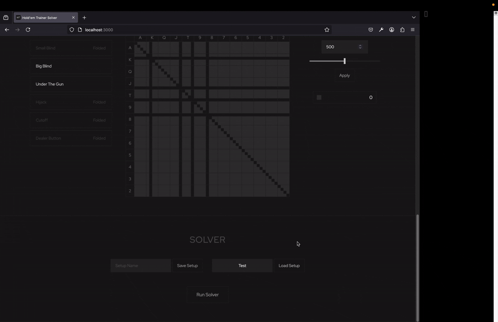

# Hold'em Trainer Solver Client

This repo contains the client facing end of a Texas Hold'em Poker Solver I am developing.
The repository of the solver code is private.
Please contact me at alonlandmann@proton.me for more information.

## Use

The solver allows you to set up a game-scenario that you would like to investigate. You should also declare the ranges of hands each player is likely to have (a relative probability for each 2-card combination needs to be given for each player).

The solver then computes an approximate Nash Equilibrium going forward. This means it shows how each player should play with each hand so that he may not be exploited directly by other players. This Game Theory Optimal play is an important solution concept in Poker, and the solver can compute it for you.

