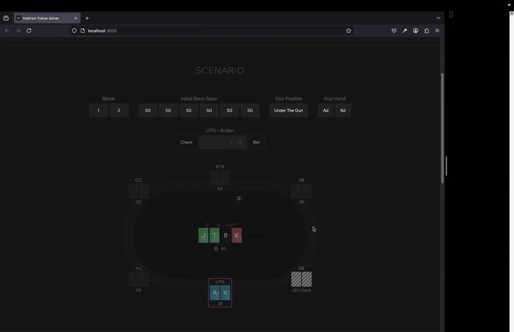
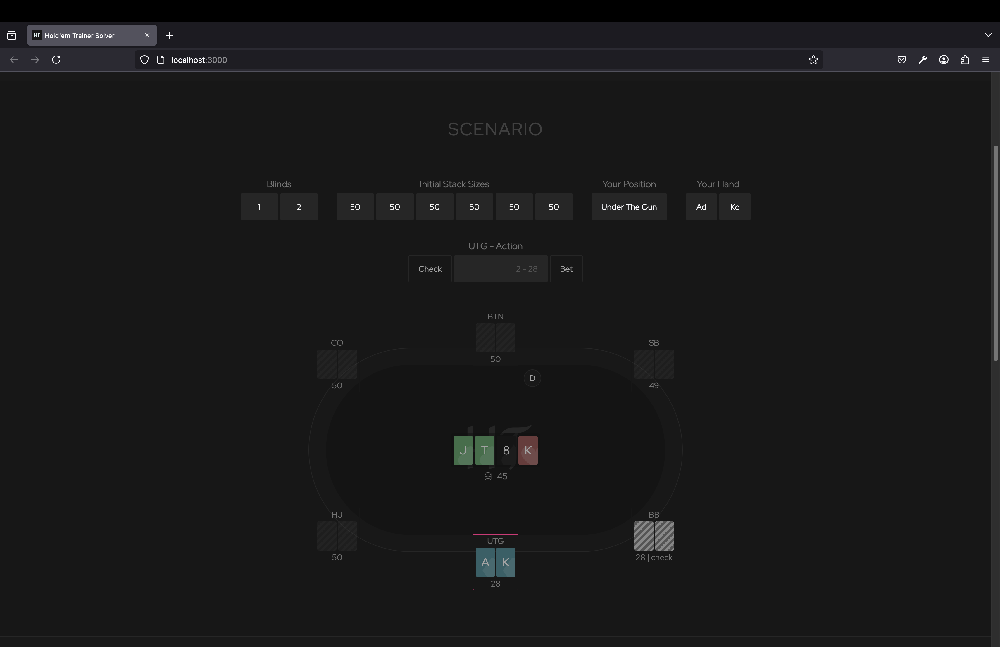
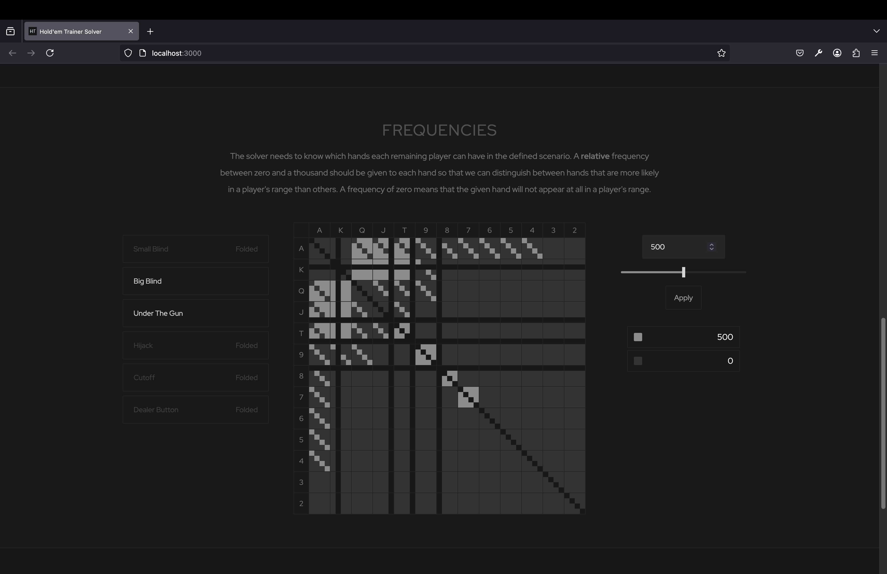

# Texas Hold'em Poker Solver

This repo contains the client facing end of a Texas Hold'em Poker Solver that I am currently developing.
**The repository of the solver code is private.**
Please contact me at alonlandmann@proton.me for access and inquiries.

## What solvers do
The solver allows you to set up a specific game scenario and investigate how you should play in that scenario.
Solvers of strategy games in general almost always try to approximate a [Nash Equilibrium](https://en.wikipedia.org/wiki/Nash_equilibrium).
In a Nash Equilibrium, every player is playing a strategy (known as an equilibrium strategy), such that no one player can change his strategy to get a better expected result.

A simple example to demonstrate this concept would be two players playing a game of rock, paper, scissors.
Let's say one of the players is playing either of the three options rock, paper, scissors with an equal probability of 33.3%,
but the other is playing a strategy where he only decides to play paper 50% of the time, and scissors 50% of the time.
If the first player figures this out, he can now deviate from his initial strategy to only playing scrissors 100% of the time.
With this strategy he will now either draw the second player, or will win with scissors cutting paper. And so he had a way to profitably deviate from his strategy.
Therefore, this pair of strategies does *not* constitute a Nash Equilibrium.
However, if both players play the equal distribution strategy of assigning 33.3% to each option, then neither of them can in fact change his strategy to get a strictly better outcome.
This is then called a Nash Equilibrium, and we can make an argument that such a strategy profile could be considered *optimal*.

Poker also has a Nash Equilbirium. With more than two players, things get more subtle, and poker is also a much more complicated game.
So the best we can do is to use numerical methods, machine learning, and other techniques to try and approximate this nash equilibrium.
The solver that underlies this front-end is based on the [Counter-Factual Regret Algorithm](https://proceedings.neurips.cc/paper/2007/file/08d98638c6fcd194a4b1e6992063e944-Paper.pdf) first proposed in 2007,
and implemented in C. Please contact me for access to this code.

## How this solver works
To work with this solver, you first define the in-game scenario you wish to investigate by defining a multitude of parameters.
You then run the solver, and the solver computes an approximate Nash-Equilbrium strategy for every remaining playing going forward from the scenario you defined.
This result is represented in range-matrix format, where each cell corresponds to a particular 2-card combination making up the hand of a player.
The colors in the result tell you what to do with each hand.

## Setup
To set up the game scenario we have to define the following parameters.
1. The Stack sizes (amount of chips) each player has at the start of the hand.
2. The size of the blinds.
3. Your hand and position relative to the dealer (this information is not fed into the solver, and only serves the user to orient themselves).
4. The history of actions that have taken place so far in the hand (folds, calls, checks, bets, and, raises).
5. A guess as to the possible hands each remaining player might possibly have in this scenario (see next section).

## Frequencies
A real-time solver only solves part of the game-tree by looking only forward from a given spot into the future.
It therefore needs to know some of the consequences of the past actions that have already taken place.
For instance, when a player re-raises before the flop, he is very unlikely to have a hand like 5 of hearts, 3 of clubs.
This is important information that the solver needs to know about.

We thus need to declare which hands each remaining player is likely to have, and how frequent they are relative to each other.
With the current user-interface we do this by simply assigning a relative frequency between 1 and 1000 to each hand.
If one hand has a frequency of 1000, and the other a frequency of 250, the solver understands that the latter hand is four times less likely to be in a player's hands than the first.

## Results

